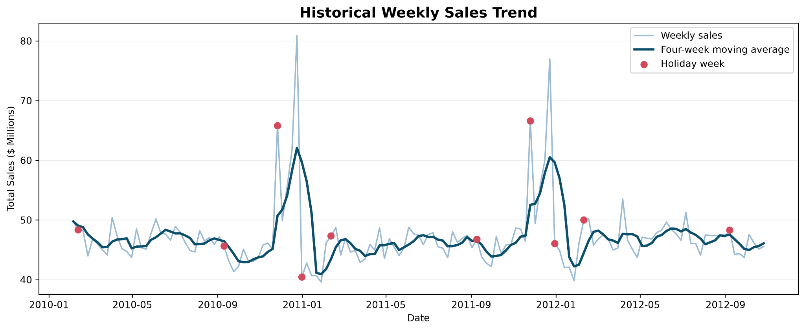
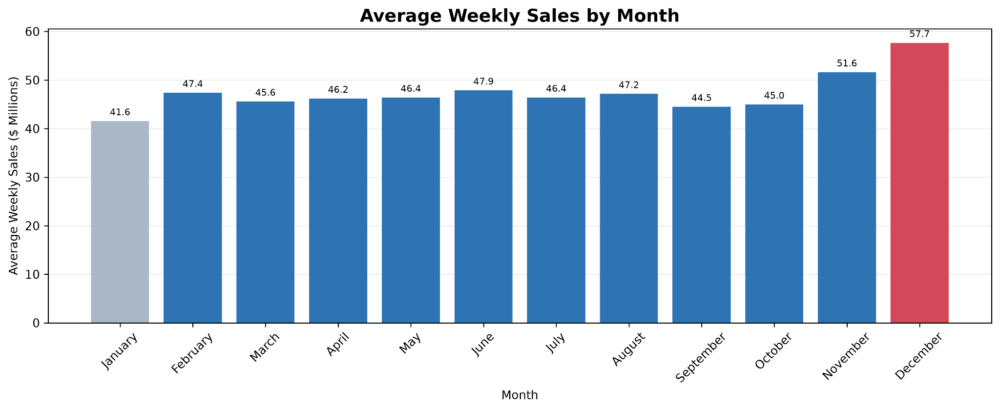
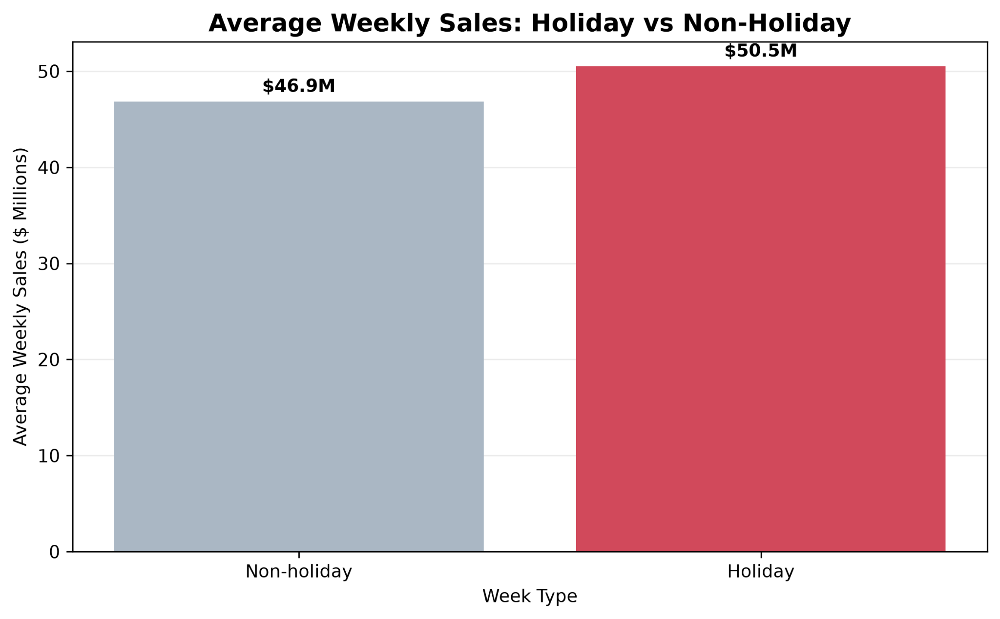
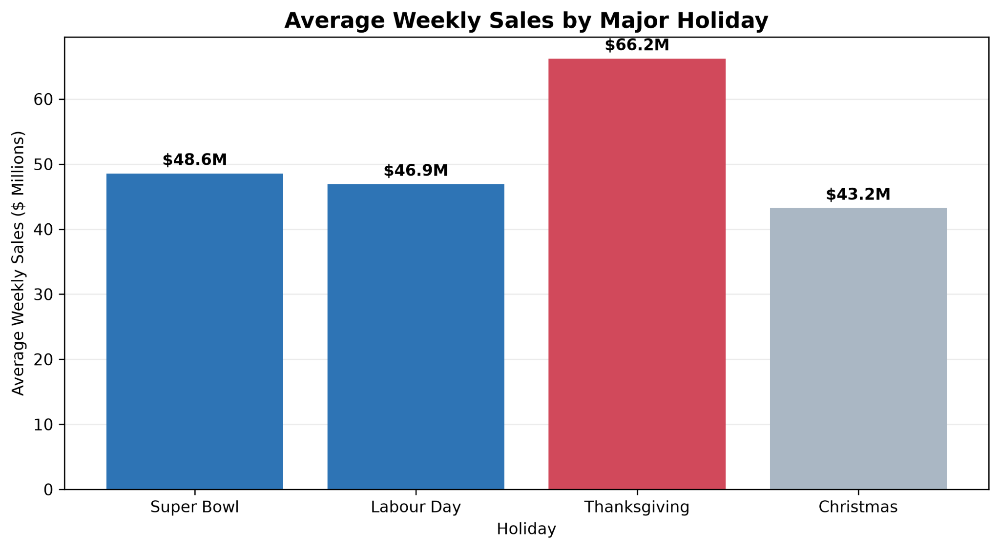
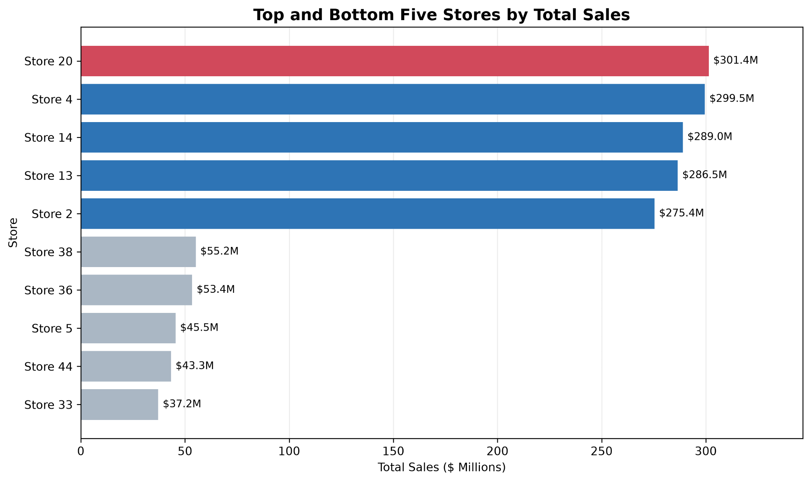
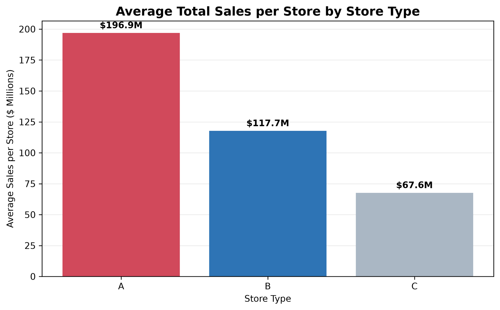
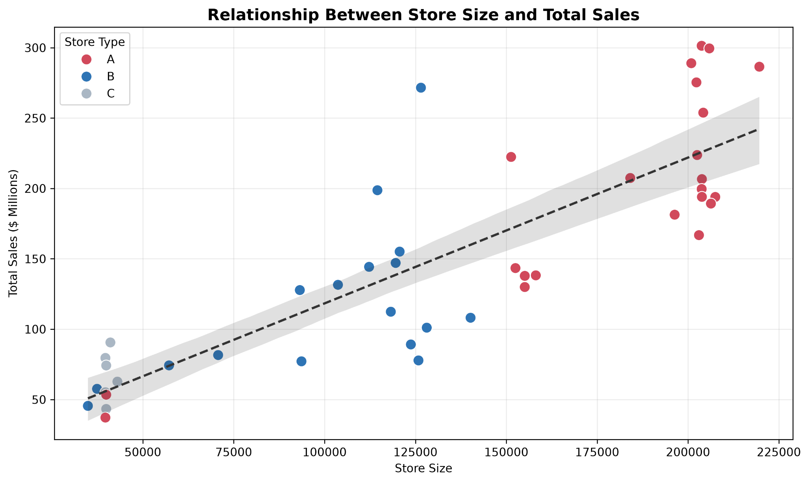
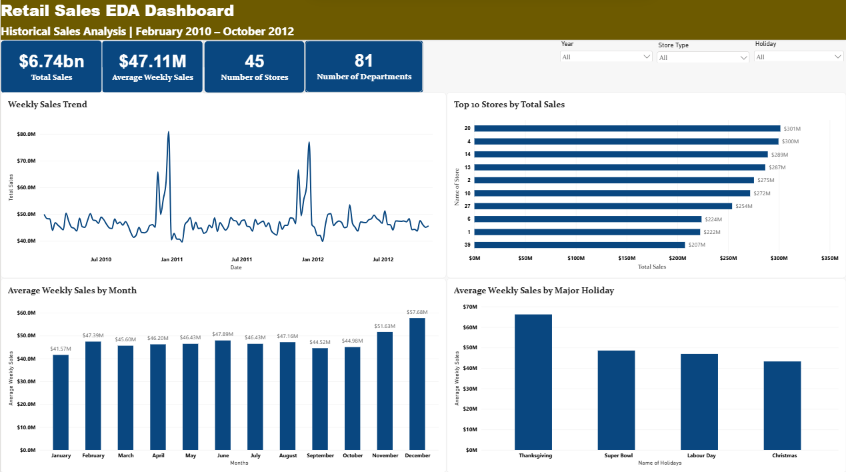
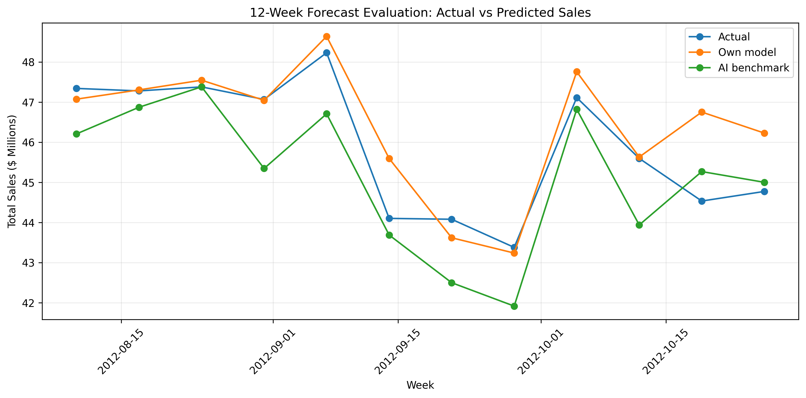

# Retail Sales Analytics & Forecasting

**Python · Power BI · Pandas · Scikit-learn · Exploratory Data Analysis · Time-Series Forecasting**

A portfolio case study exploring **421,570 weekly store–department sales records** across **45 stores**, using historical data cleaning, visual analytics and time-ordered predictive modelling.

📄 **[Read the three-page project case study (PDF)](docs/Project_Case_Study.pdf)**

## Overview

| Measure | Result |
|---|---|
| Date range | 5 February 2010 – 26 October 2012 |
| Coverage | 45 stores, 81 departments, 143 weeks |
| Total recorded sales | **$6.74 billion** |
| Highest company-wide sales week | **24 December 2010 — $80.93m** |
| Mean weekly sales: holiday vs other | **$50.53m vs $46.86m (+7.84%)** |
| Top / bottom store by total sales | Store 20 ($301.4m) / Store 33 ($37.2m) |
| Forecasting test | Final 12 weeks, **32,938** eligible store–department–week rows |
| Gradient Boosting vs annual naive baseline | MAE **$1,294.90** vs **$1,778.68** |

Results are drawn from the source data, saved chart results and notebooks. [See the methodology and limitations](docs/Methodology_and_Limitations.md).

## Business questions

1. What patterns appear in company sales by week, month and major holiday?
2. Which locations and store types have higher historical sales?
3. Can a lag-based regression model improve on a simple historical baseline during a held-out period?

## Selected visualisations

### Historic sales and seasonality

### Holiday comparison

### Store analysis

### Power BI snapshot

### Forecasting evaluation

The reported **Gradient Boosting** model had lower errors on the historical holdout than the 52-week seasonal-naive baseline; this does not imply future performance is guaranteed.

| Metric | Histogram Gradient Boosting | 52-week seasonal naive |
|---|---:|---:|
| MAE | $1,294.90 | $1,778.68 |
| RMSE | $2,696.99 | $3,752.05 |
| Holiday-weighted MAE | $1,344.84 | $1,811.82 |
| WAPE | 7.74% | 10.63% |

## Files and folders

| Item | Purpose |
|---|---|
| [`docs/Project_Case_Study.pdf`](docs/Project_Case_Study.pdf) | **Three-page case study** with figures and recommendations |
| [`notebooks/01_data_preparation_and_eda.ipynb`](notebooks/01_data_preparation_and_eda.ipynb) | Data quality, merging, EDA |
| [`notebooks/02_sales_forecasting_and_holiday_analysis.ipynb`](notebooks/02_sales_forecasting_and_holiday_analysis.ipynb) | Model comparisons and holiday forecasting |
| [`figures/`](figures/) | Analysis and Power BI visuals |
| [`results/`](results/) | Small summary tables and documented evaluation metrics |
| [`docs/Reproduction_Guide.md`](docs/Reproduction_Guide.md) | Setup instructions |
| [`docs/Methodology_and_Limitations.md`](docs/Methodology_and_Limitations.md) | Methods, provenance, cautions |
| [`01_Raw_Data/`](01_Raw_Data/) | Three original Kaggle CSVs, licensed **CC0 Public Domain** |
| [`powerbi/Retail_Sales_EDA_Dashboard.pbix`](powerbi/Retail_Sales_EDA_Dashboard.pbix) | Downloadable interactive Power BI report (open with Power BI Desktop) |
| [`docs/DATA_SOURCE_AND_LICENSE.md`](docs/DATA_SOURCE_AND_LICENSE.md) | Dataset licence and attribution |

## Interactive Power BI dashboard

The repository contains the **original `.pbix`** in [`powerbi/`](powerbi/). GitHub cannot display `.pbix` as an interactive report in the browser; download it and open it with Microsoft Power BI Desktop. The charts and screenshot here provide an accessible preview.

## Run locally

1. The original source CSVs are **already included** in `01_Raw_Data/` under the Kaggle dataset’s CC0 licence.
2. Install dependencies: `pip install -r requirements.txt`.
3. Launch Jupyter from this project folder with `jupyter lab`.
4. Run the EDA notebook, followed by the forecasting notebook.
5. To inspect the interactive Power BI dashboard, download and open `powerbi/Retail_Sales_EDA_Dashboard.pbix` in Power BI Desktop. If needed, update local CSV source paths in Power Query.

[Full reproduction guide →](docs/Reproduction_Guide.md)

## Scope, permissions and provenance

This is a **portfolio adaptation of academic work**, not a deployed commercial forecasting service. The original coursework was submitted as a group assessment. This repository presents technical analysis artifacts without a claim that the original group submission was sole-authored. AI assistance was used to support comparison design and explanatory drafting; numerical outputs were computed in the source notebooks.

**Dataset:** [Kaggle — Retail Data Analytics](https://www.kaggle.com/datasets/manjeetsingh/retaildataset), marked **CC0: Public Domain**. The three original CSVs are included for reproducibility; the downloadable `.pbix` is also included. [Data source and licence details](docs/DATA_SOURCE_AND_LICENSE.md). Model estimates for dates after October 2012 are unverified.
